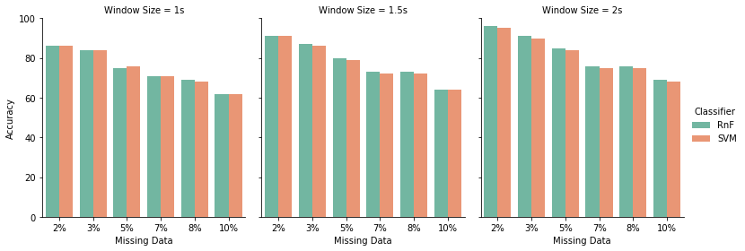
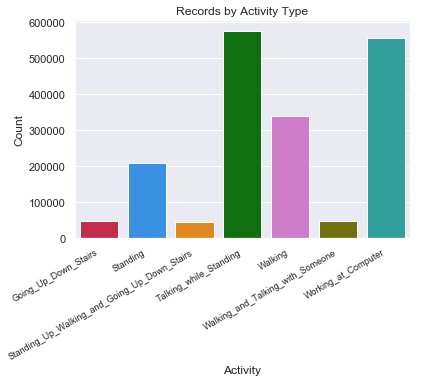
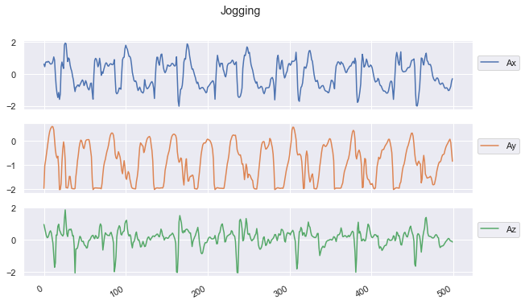
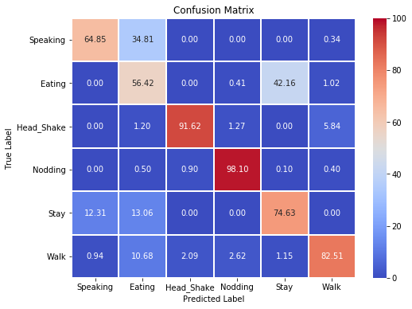

# HAR Data Analysis

Analysis human activity recognition datasets. Visualizing the data through different types of plots.

# Dataset

  - **HASC**
  - **DUMD**
  - **SingleChest**

# Tools

- **Jupyter Notebook**

# Description
- **DUMD** missing data graph based on window size  

- **Single Chest** dataset activity types  

- **HASC** dataset jogging activity plot  

- Confusion Matrix of human activities  

